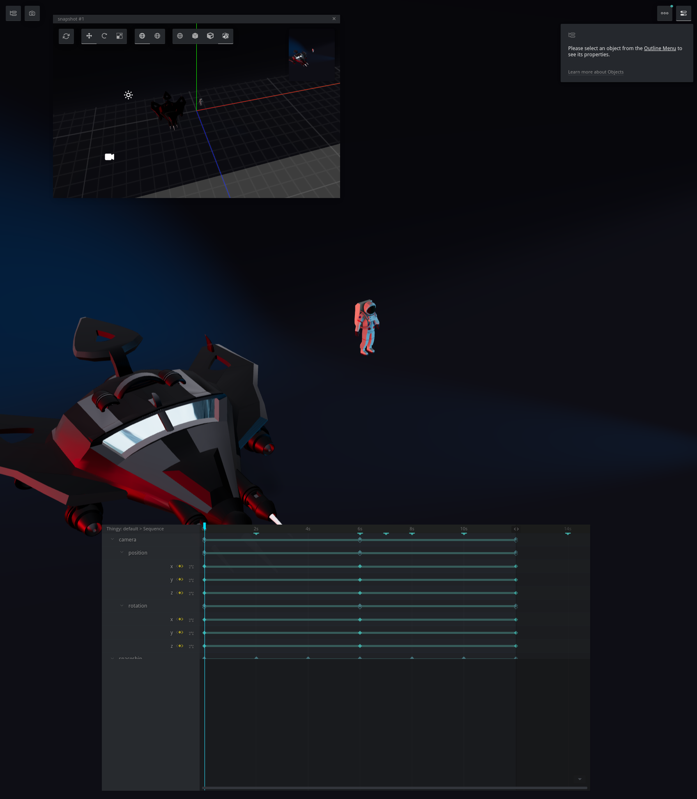

# Theatre.js + r3f demo project

## Usage

- Install the dependencies:

```bash
yarn
```

- Start the dev server:

```bash
yarn dev
# Listens on port 3000 if it's not taken
```

Open `localhost:3000` in the browser (the port may be different, see the output
of the latest command in the terminal).

You should see something like this:


